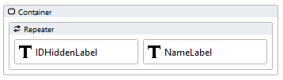
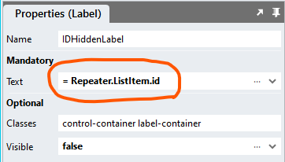
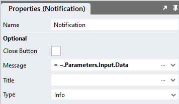
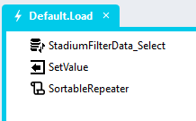

# Sortable Repeater

A module to enable users to manually sort repeater items

https://github.com/user-attachments/assets/d9d8a116-3fb8-4f9f-ba61-6a537525dd5c

# Version
Initial 1.0

# Setup

## Database, Connector and Repeater
1. Use the instructions from [this repo](https://github.com/stadium-software/samples-repeater) to setup the database and *Repeater* for this sample

## Application Setup
1. Check the *Enable Style Sheet* checkbox in the application properties

## Global Script
1. Create a Global Script called "SortableRepeater"
2. Add the input parameters below to the Global Script
   1. Callback
   2. ContainerClass
   3. ShowButtons
3. Drag a *JavaScript* action into the script
4. Add the Javascript below into the JavaScript code property
```javascript
/* Stadium Script v1.0 https://github.com/stadium-software/sortable */
let scope = this;
let containerClass = ~.Parameters.Input.ContainerClass || "";
let showButtons = ~.Parameters.Input.ShowButtons || false;
let callback = ~.Parameters.Input.Callback;
let container = document.querySelectorAll("." + containerClass);
if (container.length == 0) {
    console.error("The class '" + containerClass + "' is not assigned to any Container control");
    return false;
} else if (container.length > 1) {
    console.error("The class '" + containerClass + "' is assigned to multiple Container controls. Containers using this script must have unique classnames");
    return false;
}
container = container[0].querySelector(":scope > .stack-layout-container");
container.classList.add("stadium-sortable");
let els = container.querySelectorAll(".repeater-layout");
for (let i = 0; i < els.length; i++) {
    let elContainer = document.createElement("div");
    elContainer.classList.add("row-content");
    let elHTML = els[i].querySelectorAll(":scope > div");
    for (let j = 0; j < elHTML.length; j++) {
        elContainer.appendChild(elHTML[j]);
    }
    els[i].appendChild(elContainer);
    els[i].setAttribute("style","view-transition-name: t-" + (i + 1) + ";");
    els[i].setAttribute("draggable","true");

    if (showButtons) {
        let upBtn = document.createElement("div");
        upBtn.classList.add("upBtn", "action-button");
        upBtn.addEventListener("click",moveUp);
        els[i].appendChild(upBtn);

        let downBtn = document.createElement("div");
        downBtn.classList.add("downBtn", "action-button");
        downBtn.addEventListener("click",moveDown);
        els[i].appendChild(downBtn);
    }
}
function moveUp(e) {
    const listItem = e.target.closest(".repeater-layout");
    const prevListItem = listItem.previousElementSibling;
    if (prevListItem) {
        document.startViewTransition(() => {
            listItem.parentNode.insertBefore(listItem, prevListItem);
            callCallback();
        });
    }
}
function moveDown(e) {
    const listItem = e.target.closest(".repeater-layout");
    const nextListItem = listItem.nextElementSibling;
    if (nextListItem) {
        document.startViewTransition(() => {
            listItem.parentNode.insertBefore(nextListItem, listItem);
            callCallback();
        });
    }
}
container.addEventListener("dragstart", (e) => {
    console.log(e.target);
    e.target.classList.add("dragging");
});
container.addEventListener("dragend", (e) => {
    e.target.classList.remove("dragging");
    callCallback();
});
container.addEventListener("dragover", (e) => {
    e.preventDefault();
    const afterElement = getDragAfterElement(container, e.clientY);
    const draggedItem = container.querySelector(".dragging");
    if (afterElement == null) {
        container.appendChild(draggedItem);
    } else {
        container.insertBefore(draggedItem, afterElement);
    }
});
const getDragAfterElement = (container, y) => {
	const draggableElements = [
		...container.querySelectorAll(".repeater-layout:not(.dragging)")
    ];
	return draggableElements.reduce((closest, child) => {
        const box = child.getBoundingClientRect();
        const offset = y - box.top - box.height / 2;
        if (offset < 0 && offset > closest.offset) {
            return {
                offset: offset,
                element: child
            };
        } else {
            return closest;
        }
    },{offset: Number.NEGATIVE_INFINITY}
	).element;
};
function callCallback(){
    let childEls = container.querySelectorAll(".repeater-layout");
    let order = [];
    for (let i = 0;i<childEls.length;i++) {
        order.push(Array.from(childEls[i].querySelectorAll(".row-content .control-container"), ({textContent}) => textContent.trim()).filter(Boolean).join('; '));
    }
    scope[callback](order);
}
```

## Page
1. Drag a *Container* control to the page
2. Drag the *Repeater* control you created above into the *Container*
3. Add a class to uniquely identify the *Container* to the *classes* property (e.g. sortable-items)
4. Drag *Label* controls next to each other into the *Repeater* control that users will be able to sort



5. Assign a *Repeater.ListItem* property to each *Label* text property



## Page Script
1. Create a script under the page (call it "GetOrder")
2. Add an input parameter to the script called "Data". The script will return the sorted data to this parameter.
3. To see the returned data, drag a *Notification* into the script and assign the "Data" input paremeter to the *Notification Message* property



## Page.Load
1. Place the "SortableRepeater" global script as the last item into Page.Load event
2. Provide values for the script input parameters
   1. Callback: Add the name of the page script you created (e.g. GetOrder)
   2. ContainerClass: Add the classname you assigned to the *Container* control above (e.g. sortable-items)
   3. ShowButtons (optional): Add "true" to show up and down buttons to each repater row



## CSS
The CSS below is required for the correct functioning of the module. Some elements can be [customised](#customising-css) using a variables CSS file. 

1. Create a folder called "CSS" inside of your Embedded Files in your application
2. Drag the two CSS files from this repo [*stadium-sortable-variables.css*](stadium-sortable-variables.css) and [*stadium-sortable.css*](stadium-sortable.css) into that folder
3. Paste the link tags below into the *head* property of your application
```html
<link rel="stylesheet" href="{EmbeddedFiles}/CSS/stadium-sortable.css">
<link rel="stylesheet" href="{EmbeddedFiles}/CSS/stadium-sortable-variables.css">
``` 

### Customising CSS
1. Open the CSS file called [*stadium-sortable-variables.css*](stadium-sortable-variables.css) from this repo
2. Adjust the variables in the *:root* element as you see fit
3. Overwrite the file in the CSS folder of your application with the customised file

### CSS Upgrading
To upgrade the CSS in this module, follow the [steps outlined in this repo](https://github.com/stadium-software/samples-upgrading)

## Working with Stadium Repos
Stadium Repos are not static. They change as additional features are added and bugs are fixed. Using the right method to work with Stadium Repos allows for upgrading them in a controlled manner. How to use and update application repos is described here 

[Working with Stadium Repos](https://github.com/stadium-software/samples-upgrading)
